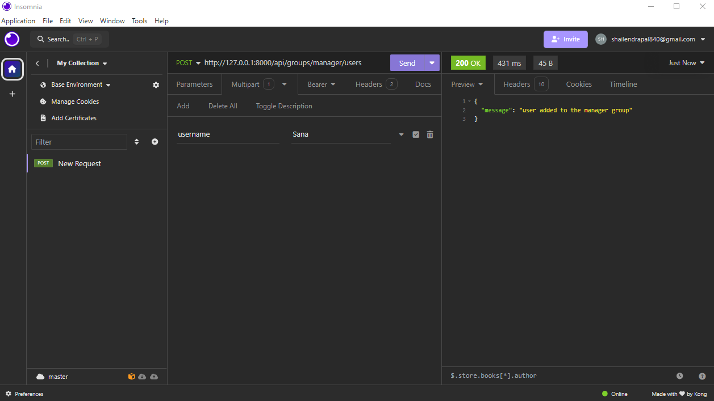
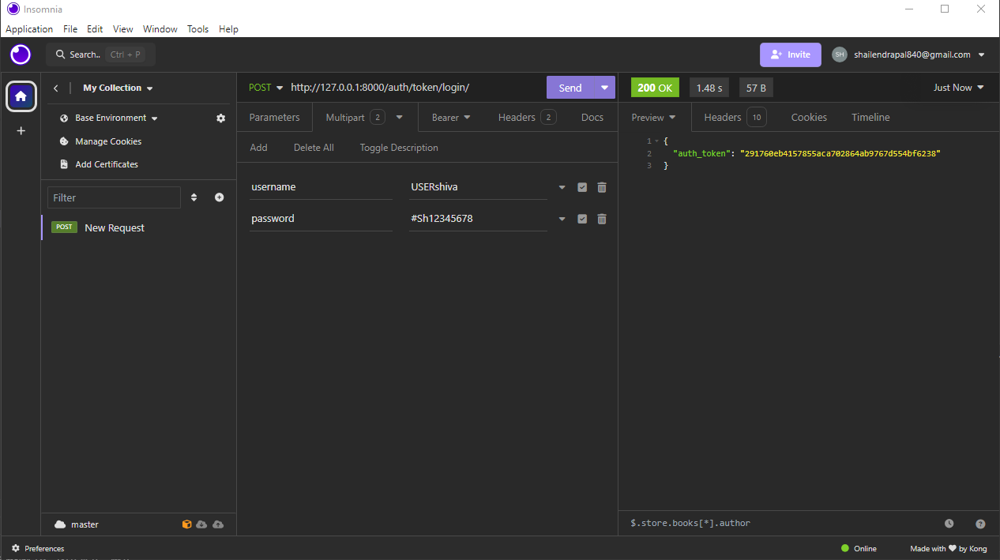
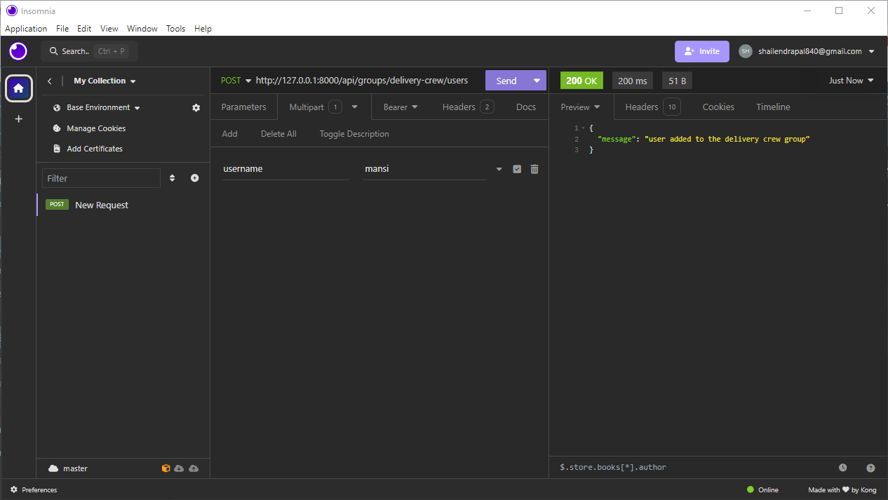
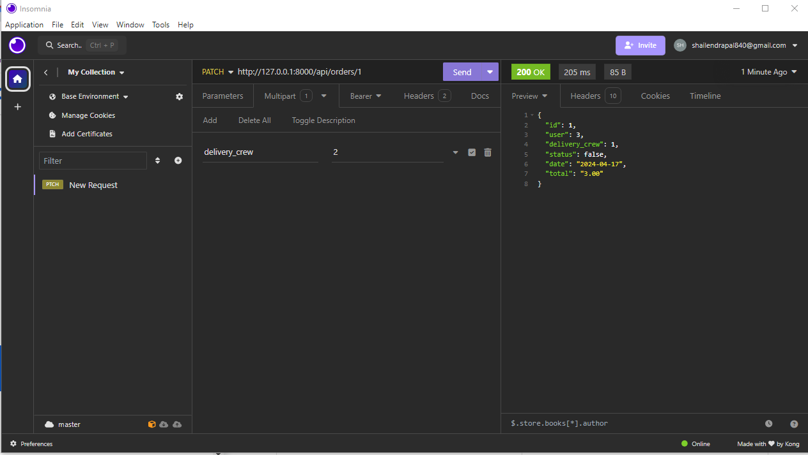
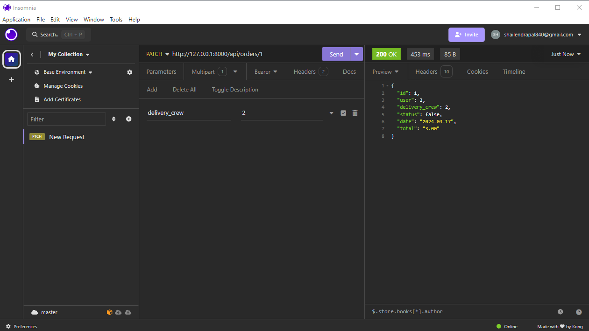
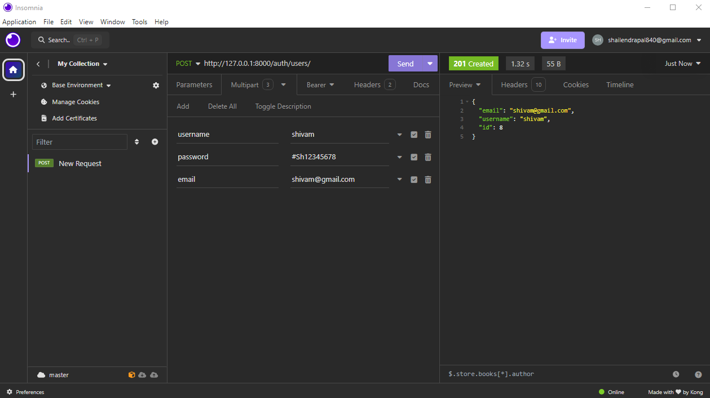
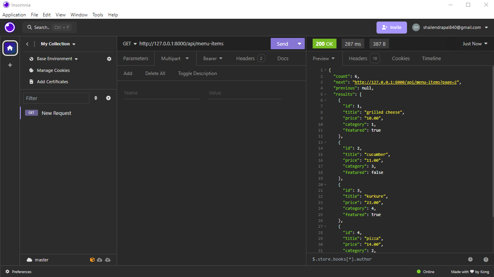
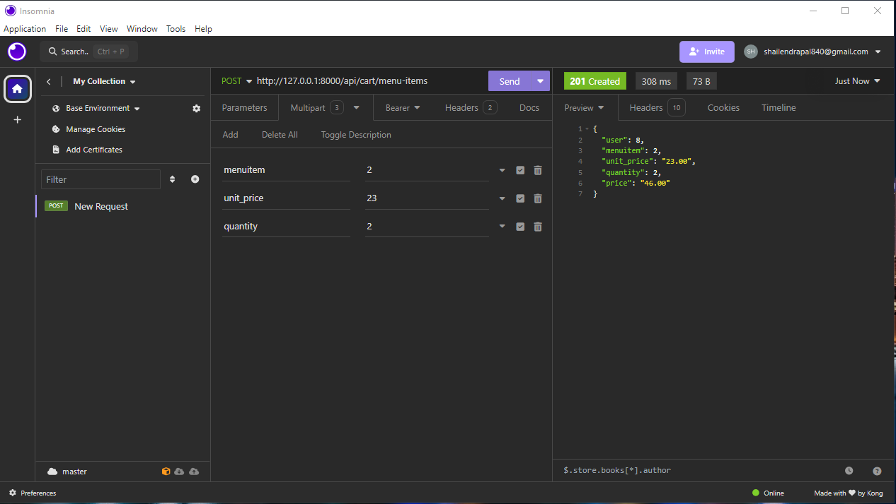

# Screnshots :-
1. Adding user to the manager group.

2. Manager login using username and password and generating token.

3. Adding user to delivery crew using manager token.

4. Manager Assigning orders to delivery crew.

5. Order assigned to delivery crew.

6. Registering Customer.

7. Logging in as customer and generating token.

8. Customer browsing through menu-items.

9. Customer adding item to cart.

# API_Project

This project implements a set of APIs to facilitate various functionalities for an online food ordering and delivery system. The APIs are designed to cater to different user roles including admins, managers, delivery crew, and customers.

## Functionalities

In this project, the APIs provide the following functionalities:

1. **Admin Features:**
   - Assign users to the manager group
   - Access the manager group with an admin token
   - Add menu items
   - Add categories

2. **Manager Features:**
   - Log in
   - Update the item of the day
   - Assign users to the delivery crew
   - Assign orders to the delivery crew
   - Access orders assigned to them

3. **Delivery Crew Features:**
   - Access orders assigned to them
   - Update an order as delivered

4. **Customer Features:**
   - Register
   - Log in using username and password to obtain access tokens
   - Browse all categories
   - Browse all menu items at once
   - Browse menu items by category
   - Paginate menu items
   - Sort menu items by price
   - Add menu items to the cart
   - Access previously added items in the cart
   - Place orders
   - Browse their own orders

## Usage

To run the API_Project locally, follow these steps:

**Clone the repository:**
git clone https://github.com/your_username/RestaurantSite.git

**Navigate to the project directory:**
cd LittleLemon

**Install dependencies:**
pip install pipenv->
pipenv install->
pipenv shell

**Run the development server:**
python manage.py runserver

Access the website in your API Development Platform at http://localhost:8000.

## Technologies Used

- Django
- Django Rest Framework
- Djoser
- Insomnia for testing the API.

## Contributing

Contributions are welcome! If you have any suggestions, improvements, or bug fixes, please submit a pull request. For major changes, please open an issue first to discuss the changes.

## License

This project is licensed under the [MIT License](LICENSE).
